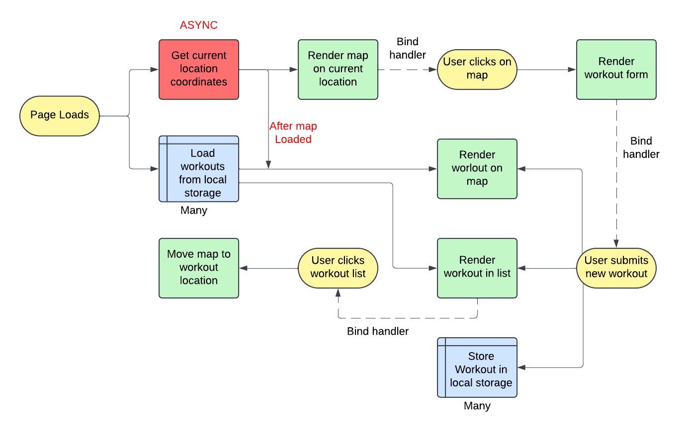

# Mapty App

_Walkthrough project - The Complete JavaScript Course 2024: From Zero to Expert!_

**_Will be working on this app at later stage to make it more user friendly, more features, the ability for users to log and track their progress on any device and responsivene design. At the moment its completed as upto the walkthrough Lecture._**

## User Stories

1. As A user, I want to log my running workouts with location, distance, time, pace and steps/minute, so I can keep log of all my running.

2. As a user, Iwant to log my cycling workouts with location, distance, time, speed and elevation gain, so I can keep log of all my cycling.

3. As a user, I want to see all my workouts at a glance, so I can easily track my progress over time.

4. As a user, I want to also see my workouts on a map, so I can easily check out where I work the most.

5. As a user, I want to see all my workouts when i leave the app and come back later, so I can keep using the app over time.

## Fetures

- Map where users click to add new workout.
- Geolocation to display map at current location.
- Form to input distance, time, pace steps/minute.
- Form to input distance, time, speed, elevation gain.
- Display all workouts in a list.
- Display all workouts on a map.
- Store workout data in the browser using local storage API.
- On page load, read the saved data from local storage and display.

## Mapty Flowchart

## Mapty Architecture

